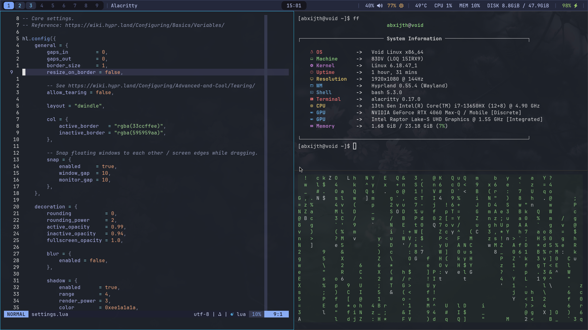

# hyprland configuration for void linux



## Install Packages
```
sudo xbps-install -Suy
sudo mkdir -p /etc/xbps.d/ && sudo cp /usr/share/xbps.d/00-repository-main.conf /etc/xbps.d/ && sudo sed -i "1i repository=https://mirror.black-hole.dev/$(xbps-uhelper arch)" /etc/xbps.d/00-repository-main.conf
sudo xbps-install -S void-repo-nonfree hyprland xdg-desktop-portal-hyprland xdg-desktop-portal swaybg Waybar grim slurp git curl wl-clipboard wget xorg-fonts dbus elogind polkit alacritty firefox neovim ripgrep bat fastfetch brightnessctl pipewire wireplumber alsa-pipewire pamixer pulseaudio-utils
```

## Setup Graphics Drivers
```
differs for each host
```

## Setup Dotfiles 
```
set it up according to the repo's folder structure
```

## Enable Services
```
sudo ln -s /etc/sv/dbus /var/service/
sudo ln -s /etc/sv/elogind /var/service/
sudo mkdir -p /etc/alsa/conf.d/ && sudo ln -s /usr/share/alsa/alsa.conf.d/50-pipewire.conf /etc/alsa/conf.d/ && sudo ln -s /usr/share/alsa/alsa.conf.d/99-pipewire-default.conf /etc/alsa/conf.d/ 
sudo mkdir -p ~/.config/pipewire/pipewire.conf.d/ && sudo ln -s /usr/share/examples/pipewire/20-pipewire-pulse.conf ~/.config/pipewire/pipewire.conf.d/ 
```

## Setup Fonts 
```
sudo mkdir -p ~/.local/share/fonts/ && cd /tmp && curl -fLO https://github.com/ryanoasis/nerd-fonts/releases/latest/download/JetBrainsMono.zip && unzip /tmp/JetBrainsMono.zip -d ~/.local/share/fonts/JetBrainsMonoNerdFont && fc-cache -fv
```

## Done
```
start-hyprland
```
